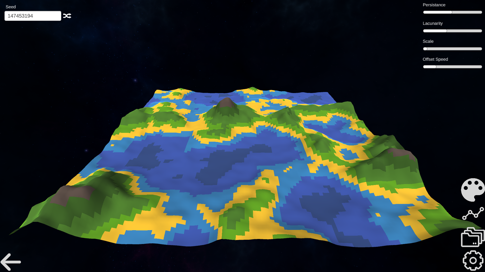

# Lands-of-the-Noise

This is the official github page of the Lands of the Noise, an app showcasing procedural generation, originally developed by the team "Інформатична Постіронія" for the [XIX All-Ukraine Student Tournament of Young Computer Scientists](https://sites.google.com/view/informaticaturnir/%D1%83%D1%80%D0%BE%D1%87%D0%B8%D1%81%D1%82%D0%B5-%D0%B7%D0%B0%D0%BA%D1%80%D0%B8%D1%82%D1%82%D1%8F-xx-%D0%B2%D1%81%D0%B5%D1%83%D0%BA%D1%80%D0%B0%D1%97%D0%BD%D1%81%D1%8C%D0%BA%D0%BE%D0%B3%D0%BE-%D1%83%D1%87%D0%BD%D1%96%D0%B2%D1%81%D1%8C%D0%BA%D0%BE%D0%B3%D0%BE-%D1%82%D1%83%D1%80%D0%BD%D1%96%D1%80%D1%83-%D1%8E%D0%BD%D0%B8%D1%85-%D1%96%D0%BD%D1%84%D0%BE%D1%80%D0%BC%D0%B0%D1%82%D0%B8%D0%BA?authuser=0) (in Ukrainian only) in 2023.



🛠 Key Features
- 🌐 Feature 1: Adjust parameters of [Procedural Generation](https://en.wikipedia.org/wiki/Procedural_generation) based on [Perlin Noise](https://en.wikipedia.org/wiki/Perlin_noise).
- 📊 Feature 2: Save and load presets of Procedural Generation.
- 🔍 Feature 3: Learn about Procedural Generation based on Perlin Noise.

🛠 Supported Platforms
- 🪟 Windows (x64)
- 🐧 Linux (x64)
- 🍏 MacOS (Intel & Apple Silicon)


## How to run the app
## Run the Built Version (recommended):
Refer to the [Releases](https://github.com/dmolan/Lands-of-the-Noise/releases) page.

## Open the Unity Project (not recommended):
Ensure **Unity version [2019.4.40](https://unity.com/releases/editor/whats-new/2019.4.40)** is installed.

To get started with the project, follow these steps to clone the repository, including the large files managed by Git LFS.

### 1. Prerequisites
Ensure that you have **Git** and **Git LFS** installed. If you haven't installed them yet, follow these steps:

#### Install Git
- Download Git from the official website: [Git Downloads](https://git-scm.com/downloads).
- Follow the installation instructions for your operating system.

#### Install Git LFS
- Download Git LFS from the official website: [Git LFS](https://git-lfs.github.com/).
- Follow the installation instructions for your operating system.
- After installation, run the following command to initialize Git LFS:
   ```bash
   git lfs install
   ```
### 2. Clone the Repository
Open your terminal (or Git Bash on Windows).
Clone the repository using the following command:

#### Using HTTPS
```bash
git clone https://github.com/dmolan/Lands-of-the-Noise
```

#### Using SSH (if you have SSH set up with GitHub):
```bash
git clone git@github.com:dmolan/Lands-of-the-Noise
```

### 3. Fetch Git LFS Files
Once the repository is cloned, navigate into the project directory. Next, Git LFS files (such as large assets used in Unity) need to be fetched separately. Run the following command:
```bash
git lfs pull
```
This will download all the large files that are tracked by Git LFS, ensuring your project has all the necessary assets.

### 4. Open it using Unity Hub
*Note: one might need to import the two scenes before running the app.*
